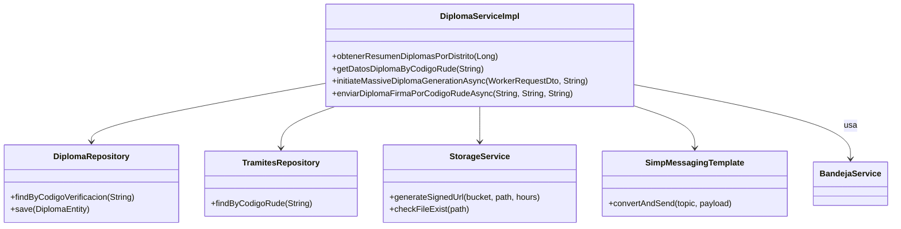
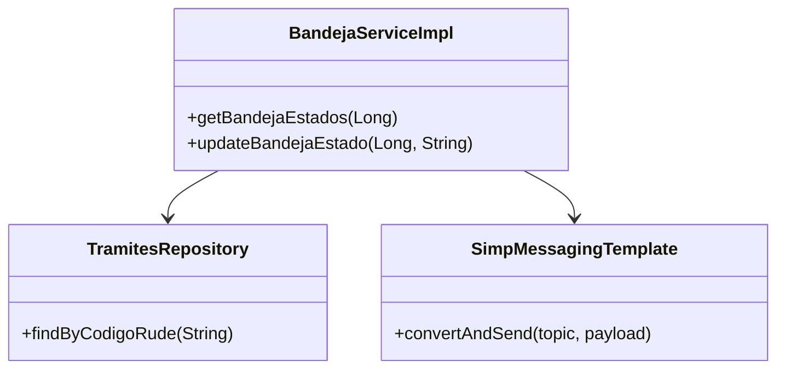
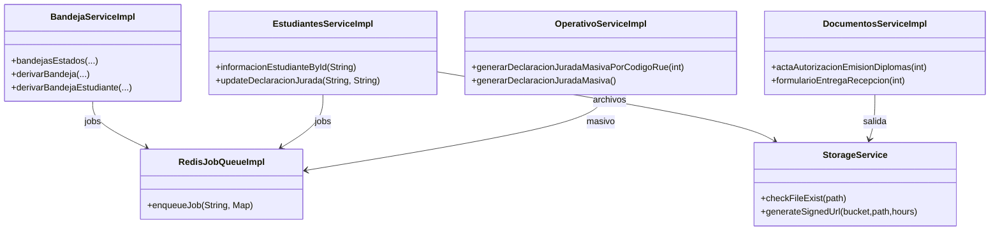
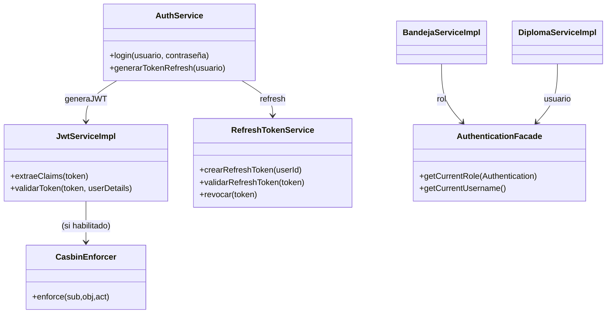
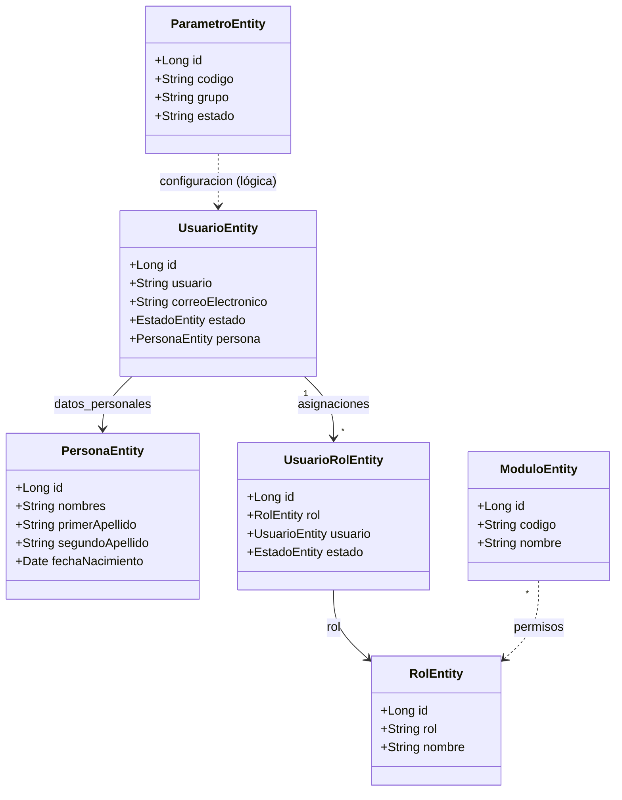
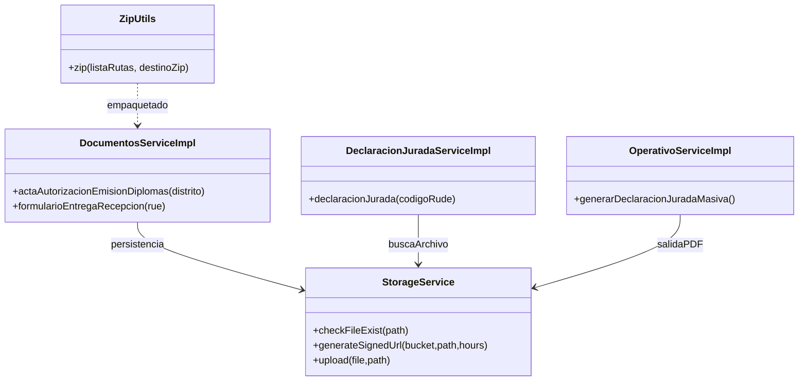
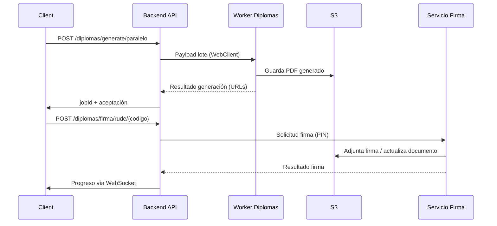

# Sistema de Emisión de Diplomas de Bachiller

# 4 Lecciones de Arquitectura de Software que Aprendimos

A primera vista, un sistema para gestionar y tramitar diplomas universitarios o escolares puede parecer un problema administrativo relativamente sencillo. Podríamos imaginarlo como un formulario web que recoge datos, genera un PDF y lo almacena en una base de datos. Una tarea de digitalización, sin más complicaciones. Sin embargo, al analizar la arquitectura de un sistema gubernamental real diseñado para esta tarea, descubrimos que detrás de esa aparente simplicidad se esconde una solución de software sorprendentemente robusta, moderna y bien diseñada.

Lejos de ser una aplicación monolítica simple, el sistema revela un ecosistema de microservicios, un modelado de procesos que abarca el mundo físico y digital, y un enfoque de seguridad flexible que muchas startups envidiarían. Este diseño demuestra una profunda comprensión no solo de la tecnología, sino del complejo problema de negocio que resuelve.

Entonces, ¿qué lecciones de diseño, resiliencia y escalabilidad podemos extraer de un sistema gubernamental bien diseñado? A continuación, exploraremos cuatro decisiones de arquitectura clave que lo convierten en un caso de estudio fascinante.

1. No es un Monolito: Es un Ecosistema de Servicios Especializados

La primera y más importante lección es que el sistema no fue concebido como una única y gran aplicación. En su lugar, es un conjunto de servicios independientes que colaboran, cada uno con una responsabilidad muy específica. Esta aproximación de microservicios es fundamental para su robustez.

El orquestador central es la Backend API (Puerto 3000), que gestiona toda la lógica de negocio del trámite, la validación de sus múltiples estados y la integración con el resto de los componentes. Sin embargo, las tareas pesadas o especializadas se delegan a otros servicios "worker" que actúan como expertos en su dominio, liberando a la API principal para que se mantenga ágil y receptiva. Los componentes clave incluyen:

* Servicio de Documentos PDF (Puerto 5000): Encargado de generar documentos previos al diploma, como declaraciones juradas y constancias auxiliares.
* Servicio de Diploma (Puerto 3100): Un worker dedicado exclusivamente al procesamiento masivo de diplomas en lote, una tarea computacionalmente intensiva.
* Servicio de Firma Digital (Puerto 7171): Actúa como un puente seguro o adaptador para integrarse con el sistema externo de firma digital de documentos.

Esta arquitectura de componentes es una decisión de diseño excepcionalmente inteligente, ya que resuelve un reto de negocio clave: la necesidad de procesar lotes masivos y periódicos de diplomas (por ejemplo, al final de un semestre) sin colapsar las funcionalidades diarias de consulta y validación. Permite que cada parte del sistema escale de forma independiente; si la generación de diplomas se convierte en un cuello de botella, solo ese servicio necesita más recursos, no todo el sistema. Este ecosistema no se detiene en el backend; se complementa con una interfaz de usuario en Next.js, persistencia en PostgreSQL, almacenamiento de objetos en MinIO S3 y Redis como el sistema nervioso central, demostrando una selección de herramientas modernas y de código abierto para cada tarea.

2. Más Allá del Código: Modelando un Proceso Híbrido (Digital y Físico)

Una de las características más reveladoras de una arquitectura bien pensada es cómo modela el proceso de negocio del mundo real. Este sistema no se limita a gestionar archivos digitales; gestiona un ciclo de vida completo que es tanto digital como físico. El núcleo de esta gestión es una máquina de estados compleja que guía cada trámite a través de sus distintas fases, desde la carga inicial hasta la entrega final. Estados como PC (Pendiente), JL (Jefe Legalización), DG (Diploma Generado) y DF (Diploma Firmado) controlan el flujo digital.

La parte más sorprendente, sin embargo, es cómo el sistema extiende su control para seguir el proceso logístico del diploma físico, una vez que ha sido firmado e impreso. Los estados del trámite no terminan cuando el PDF está listo; continúan para rastrear el objeto en el mundo real. Esto se evidencia claramente en la secuencia de estados de la "Fase de Distribución Física":

* PF (Pendiente Envío Físico)
* EF (Enviado Distrital)
* RF (Recepcionado Distrital)
* ED (Enviado Director)
* RD (Recepcionado Director)

Modelar el flujo completo de esta manera crea una única fuente de verdad para un proceso que abarca tanto el ámbito digital como el físico. Esta es una de las tareas más complejas en el software empresarial y su correcta implementación previene silos de datos y proporciona una auditabilidad de extremo a extremo, un requisito crítico en cualquier contexto gubernamental. La arquitectura reconoce que el trabajo no termina hasta que el diploma está físicamente en manos de la persona correcta.

3. La Autorización es Dinámica, no Estática: El Poder de Casbin

La gestión de permisos en un sistema con múltiples roles, como Directores de Unidad Educativa, Técnicos distritales SIE y Jefes de legalización departamental, puede volverse compleja rápidamente. Un enfoque común, pero rígido, es codificar las reglas directamente en la aplicación con sentencias como if usuario.rol == 'ADMIN'. Este sistema adopta una solución mucho más elegante y flexible.

En lugar de permisos estáticos, utiliza un enfoque de autorización basado en políticas a través de Casbin. Las reglas que definen quién puede hacer qué (por ejemplo, "un Jefe de Legalización puede aprobar un trámite en estado TL") no están en el código. Se gestionan como datos, definidos externamente en archivos como model.conf y policy.csv, y se persisten directamente en la base de datos en la tabla usuarios.casbin_rule.

La ventaja de este diseño es monumental. Si las políticas de la organización cambian y se necesita crear un nuevo rol o ajustar los permisos de uno existente, no es necesario modificar el código fuente de la aplicación ni realizar un nuevo despliegue. Los administradores pueden actualizar las políticas directamente en la base de datos, y los cambios se reflejan de inmediato. Esto proporciona una enorme flexibilidad y capacidad de adaptación a los cambios en los procesos de negocio.

4. Redis es Más que un Caché: El Motor de las Tareas Asíncronas

Para muchos desarrolladores, Redis es sinónimo de caché. Y si bien este sistema lo utiliza para ese propósito, su rol es mucho más multifacético. Según la documentación, Redis cumple tres funciones distintas: 1) Colas de trabajos diferidos, 2) Sincronización entre workers, y 3) Caché de sesiones y tokens. Su función más crítica en esta arquitectura es la primera: actuar como un intermediario de mensajes para tareas asíncronas. Cuando un usuario solicita una operación que puede ser lenta, como la generación de una declaración jurada, la API principal encola un trabajo en Redis (en la cola declaracion-juradajob) y responde inmediatamente al usuario, dándole feedback instantáneo. Un servicio worker independiente recoge el trabajo y lo procesa en segundo plano.

Este patrón no solo mejora la responsividad de la aplicación, sino que también aumenta la resiliencia del sistema. Si la generación de un PDF falla temporalmente, el trabajo permanece en la cola para ser reintentado automáticamente, sin intervención manual y sin que el usuario final se vea afectado. Al delegar tareas pesadas a colas procesadas por workers, la API principal se mantiene ligera, rápida y receptiva, incluso bajo una carga de trabajo intensa. Esto evita que los usuarios experimenten largos tiempos de espera y mejora la estabilidad general, ya que los picos de trabajo se absorben en las colas en lugar de sobrecargar la API.

Conclusión

El análisis de este sistema de trámite de diplomas demuestra que la buena ingeniería de software se puede encontrar en los lugares más inesperados. Lo que podría haber sido una simple aplicación CRUD es, en realidad, un ejemplo de arquitectura desacoplada, modelado preciso de procesos y diseño flexible. Nos enseña que la complejidad de un sistema no proviene de la tecnología que utiliza, sino de la profundidad con la que entiende y resuelve un problema del mundo real. La próxima vez que te enfrentes a un proyecto, pregúntate: ¿qué procesos del mundo real podrías modelar con mayor precisión o qué componentes podrías desacoplar para construir un sistema más robusto y flexible?

Servicio Spring Boot para la gestión integral de trámites de diplomas, procesamiento de declaraciones juradas, carga y validación documental, generación masiva y distribución segura de archivos firmados. Incluye autorización basada en políticas (Casbin) y autenticación JWT, trabajos enviados a Redis, persistencia en PostgreSQL/JPA y almacenamiento en S3. 

## 1. Resumen Funcional
- Gestión de bandejas, estados del trámite.
- Generación on-demand de Declaración Jurada con reintentos asíncronos vía Redis.
- Procesamiento masivo de diplomas mediante servicio worker externo y empaquetado ZIP.
- Almacenamiento de archivos en S3 (auto alojado).
- Sistema de estados y transición controlada (observados, rezagados, completos, generados).
- Notificaciones por correo con plantillas HTML.
- Documentación OpenAPI automática (SpringDoc).

## 2. Requisitos Técnicos

| Componente | Mínimo | Recomendado |
|------------|--------|-------------|
| Java | 21 | 21 Temurin LTS |
| Maven | 3.9.x | 3.9.9 |
| PostgreSQL | 13 | 14+ |
| Redis | 6.2 | 7.2+ (Lettuce) |
| S3 compatible | MinIO 2023+ | MinIO LTS / AWS S3 |
| Docker | 24.0 | 26.x |
| SO | Ubuntu 24.04+ | Ubuntu 24.04 LTS / Debian 13 |

### Stack y Versiones (pom.xml)

| Componente | Versión | Notas |
|------------|---------|-------|
| Spring Boot | 3.5.3 | Web MVC, WebFlux, Data JPA, Security, Redis, Actuator, Mail |
| PostgreSQL Driver | 42.7.8 | JDBC driver para PostgreSQL |
| Redis client | — | Lettuce + `commons-pool2` |
| Casbin (jcasbin) | 1.85.1 | Autorización basada en políticas |
| Casbin JDBC Adapter | 2.10.0 | Persistencia de reglas en BD |
| Casbin Spring Boot Starter | 1.9.0 | Integración y auto-configuración |
| JWT (JJWT) | 0.13.0 | Módulos API / Impl / Jackson |
| AWS SDK v2 | 2.38.3 | S3 + `url-connection-client` |
| SpringDoc OpenAPI UI | 2.8.14 | Documentación OpenAPI/Swagger |
| Lombok | — | Solo compile-time (administrado por Spring Boot) |
| JavaFaker | 1.0.2 | Datos de prueba |
| JaCoCo | 0.8.12 | Cobertura de pruebas |

## 3. Arquitectura

### 3.1. Estructura de Capas (Código)
```
src/main/java/com/minedu/planificacion/diploma/diploma_backend/
├── presentation/      # Controladores REST, DTO externos, manejo de errores
├── application/       # Servicios orquestadores, listeners, lógica de casos de uso
├── domain/            # Modelos, enums, eventos, interfaces (ports)
├── infrastructure/    # Adaptadores: JPA, Redis, S3, HTTP, seguridad, scheduling, email
├── helpers/           # Utilidades específicas de negocio
├── shared/            # Utilidades transversales (fechas, ZIP, excepciones comunes)
└── DiplomaBackendApplication.java
```

### 3.2. Vista de Componentes del Sistema (Infraestructura Completa)

### 3.3. Diagramas de Clases 

#### 3.3.1. Diagrama de Clases de DiplomaServiceImpl, Encargado de gestionar los trámites de diploma desde la creación hasta la firma digital. 


#### 3.3.2. Diagrama de Clases de BandejaServiceImpl, Encargado de gestionar los estados de los trámites de diploma.


### 3.3.3. Diagrama de Clases – Servicios Orquestadores


### 3.3.4. Diagrama de Clases – Seguridad y Autenticación


### 3.3.5. Diagrama de Clases – Usuarios y Roles


### 3.3.6. Diagrama de Clases – Almacenamiento y Generación de Documentos


### 3.3.7. Diagrama de Secuencia – Generación y Firma de Diploma


### 3.3.8. Diagrama de Secuencia – Declaración Jurada On-Demand


### 3.3.9. Diagrama de Despliegue


### 3.4. DESCRIPCIÓN DE SERVICIOS DEL SISTEMA

El Sistema de Diplomas Digitales se compone de varios servicios independientes. Cada uno cumple una función específica dentro del proceso de registro, validación, generación, firma digital y almacenamiento de documentos.

A continuación se describe la estructura de los servicios involucrados:

**1. Backend API (Puerto 3000)**
Servicio principal, expone la API REST utilizada por los actores del sistema.
Funciones:
- Gestión del trámite estudiantil.
- Validación de documentos y control de estados.
- Gestión de periodos.
- Integración con servicios externos.

**2. Frontend Web (Puerto 8080)**
Interfaz de usuario desarrollada en Next.js.
**Usuarios:**
- Directores de Unidad Educativa.
- Técnicos distritales SIE.
- Tecnico de legalizaciones
- Jefes de legalización departamental.
- Director Departamental
**Funciones:**
- Carga de documentos y fotografías.
- Seguimiento del trámite.
- Revisión y aprobación.
- Envío a firma y descargas de diplomas.

**3. Servicio de Documentos PDF (Puerto 5000)**
Worker especializado en:
- Generación de declaraciones juradas.
- Documentos previos al diploma.
- Constancias auxiliares.

**4. Servicio de Diploma (Puerto 3100)**
Worker de procesamiento masivo:
- Generación de diplomas PDF en lote.
- Renderizado de plantillas.
- Preparación previa a firma digital.

**5. Servicio de Firma Digital (Puerto 7171)**
Integración con Jacobitus:
- Firma digital PKCS#7.
- Validación de certificados.
- Firma individual o masiva.

**6. Base de Datos PostgreSQL (Puerto 5432)**
La base de datos tiene los siguientes esquemas:
- usuarios
- operativo
- parametricas
- sie_fdw (conexcion remota a la base de datos del SIE)

**7. Redis (Puerto 6379)**
Usado para:
- Colas de trabajos diferidos.
- Sincronización entre workers.
- Caché de sesiones y tokens.

**8. MinIO – Almacenamiento S3 (Puerto 9000)**
Almacena:
- PDFs finales de diplomas.
- Fotografías
- Documentación adjunta
- Archivos temporales y ZIPs


## 4. Seguridad
- Autenticación JWT HS256 (filtros personalizados para emisión y validación).
- Autorización con Casbin (`model.conf`, `policy.csv`) y tabla `usuarios.casbin_rule`.
- Refresh tokens persistidos (tabla `usuarios.refresh_tokens`) con revocación y limpieza programada.

## 5. Configuración (application.properties) – Variables Recomendadas
| Variable | Descripción | Debe ir a ENV |
|----------|-------------|---------------|
| `spring.datasource.*` | Conexión PostgreSQL principal | Sí |
| `spring.data.redis.*` | Host/puerto Redis | Sí |
| `app.s3.*` | Credenciales y endpoint S3 | Sí |
| `jwt.secret` | Clave firma JWT | Sí |
| `app.token` | Token integración API Core | Sí |
| `spring.mail.*` | SMTP credenciales | Sí |
| `app.jacobitus.*` | Firma externa Jacobitus | Sí |


## 6. Estados del Trámite (Base de Datos)
| Código | Nombre | Descripción |
|--------|--------|-------------|
| PC | Pendiente | Trámite pendiente de carga o revisión inicial |
| TL | Técnico Legalización | En revisión por técnico de legalización |
| JL | Jefe Legalización | En revisión por jefe de legalización |
| OD | Observado Distrital | Estudiante observado o con error en documentos |
| AP | Aprobado | Diploma aprobado y emitido |
| RZ | Rezagado | Trámite rezagado |
| DG | Diploma Generado | Diploma generado |
| DF | Diploma Firmado | Diploma firmado |
| DP | Diploma Pendiente | Diploma pendiente de generación |
| PF | Pendiente Envío Físico | Pendiente envío físico al distrital |
| RF | Recepcionado Distrital | Recepcionado físico distrital |
| ED | Enviado Director | Enviado al director UE |
| RD | Recepcionado Director | Recepcionado director UE |
| EF | Enviado Distrital | Enviado físico al distrital |

### Lógica de Bandejas y Transiciones


#### Descripción Detallada por Estado

**1. Fase de Ingreso y Validación Inicial**
- **PC (Pendiente)**: 
  - Estado inicial del trámite.
  - Requiere carga completa de documentación: foto del estudiante y declaración jurada firmada.
  - Validación de datos básicos del estudiante (RUDE, CI, nombres).
  - Transición a TL cuando se deriva y la documentación está completa.

**2. Fase de Revisión Técnica**
- **TL (Técnico Distrital)**:
  - Revisión el progreso de la carga de documentos, fotografia, declaracion jurada.

**3. Fase de Revisión Técnica**
- **TL (Técnico Legalización)**:
  - Revisión técnica de documentos por personal tecnico de legalizacion.
  - Verifica autenticidad de documentos, formatos y requisitos mínimos.
  - **Transiciones posibles**:
    - → JL (si documentos válidos)
    - → OD (si encuentra observaciones o errores es devuelto al Director de Unidad Educativa)

- **JL (Jefe Legalización)**:
  - Validación final por jefe de legalización.
  - Aprobación de lote y conformidad de documentación.
  - **Transiciones posibles**:
    - → AP (aprobación final)
    - → OD (si detecta inconsistencias)

**3. Fase de Observaciones (Flujo Alternativo)**
- **OD (Observado Distrital)**:
  - Trámite con observaciones o documentación deficiente.
  - Notificación automática al director de UE con detalle de observaciones.
  - Requiere corrección de documentos o subsanación de errores.
  - **Transición**: → PC (una vez subsanadas las observaciones)

**4. Fase de Generación del Diploma**
- **DP (Diploma Pendiente)**:
  - En espera de procesamiento por worker de generación masiva.
  - Se agrupa con otros trámites del mismo periodo/gestión.
  - **Transición**: → DG (al completar generación)

- **DG (Diploma Generado)**:
  - PDF del diploma generado y almacenado en S3.
  - URL presignada disponible para descarga temporal.
  - **Transición**: → DF (envío a firma digital)

**5. Fase de Firma Digital**
- **DF (Diploma Firmado)**:
  - Firma digital aplicada vía integración con servicio externo (Servicio de Firma).
  - Documento con validez legal y código de verificación.
  - **Transición**: → PF (listo para distribución física)

**6. Fase de Distribución Física**
- **PF (Pendiente Envío Físico)**:
  - Diploma firmado listo para impresión y envío.
  - Generación de lote de impresión para distrital.
  - **Transición**: → EF

- **EF (Enviado Distrital)**:
  - Lote físico enviado a la dirección distrital.
  - Registro de fecha de envío y número de guía.
  - **Transición**: → RF

- **RF (Recepcionado Distrital)**:
  - Recepción confirmada por distrital.
  - Validación de cantidad y conformidad del lote.
  - **Transición**: → ED

- **ED (Enviado Director)**:
  - Diploma enviado desde distrital hacia unidad educativa.
  - Notificación al director de UE sobre envío.
  - **Transición**: → RD

- **RD (Recepcionado Director)**:
  - **Estado final exitoso**: diploma recibido por director de UE.
  - Disponible para entrega al estudiante/apoderado.
  - Cierre del ciclo del trámite.

**7. Estado Especial: Rezago**
- **RZ (Rezagado)**:
  - Trámites que vencieron plazos establecidos sin completar requisitos.
  - Aplica desde estados: PC, TL, OD.
  - Requiere gestión administrativa especial y habilitación manual.
  - No participa en generación masiva automática.

## 9. Construcción y Ejecución

### Maven Local
```bash
./mvnw clean verify
./mvnw spring-boot:run
```
Swagger: `http://localhost:3000/swagger-ui.html` | Health: `http://localhost:3000/actuator/health`

### Imagen Docker (Multi-stage con Temurin 21)
```bash
docker build -t diploma-backend:latest .
docker run -p 5000:5000 --env-file env.list diploma-backend:latest
```
Variables sensibles deben ir en `env.list` o secretos gestionados.

### docker-compose
Configurar servicio junto a PostgreSQL/Redis/MinIO en `docker/docker-compose.yml` (agregar perfiles o variables faltantes).

## 10. Email y Plantillas
Plantillas HTML en `src/main/resources/templates/` (`email.html`, `diploma_download_email.html`). Servicio envía notificaciones asíncronas. Cambiar `spring.mail.*` a variables de entorno en producción (TLS 1.2 configurado).

## 11. Almacenamiento S3
Servicio `S3StorageService` maneja subida/descarga y generación de URLs firmadas (presignadas). Bucket por defecto: `diplomas`. Recomendado habilitar versionado y lifecycle policies para limpieza de artefactos temporales.

## 13. Redis y Jobs Diferidos
Cola `declaracion-juradajob` para generación diferida. Prefijo y patrón configurables (`app.queue.key.*`). Ajustar TTL y políticas de retry según carga real.

## 14. Firma Digital
Integración con el servicio de firma Digital (`app.jacobitus.api.firma.lote`).
