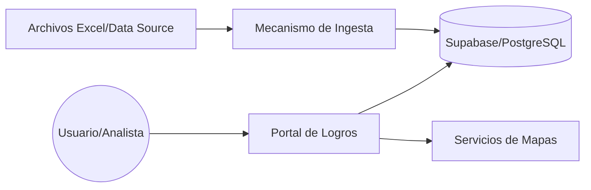
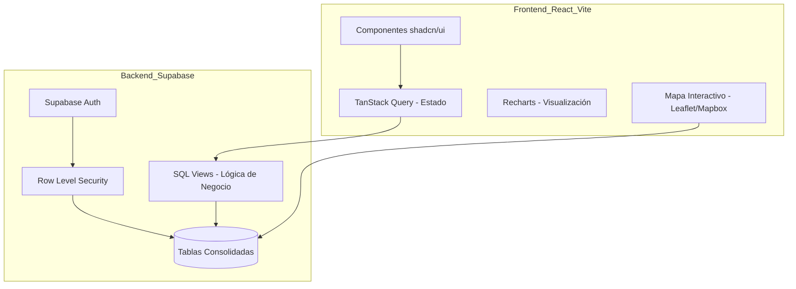
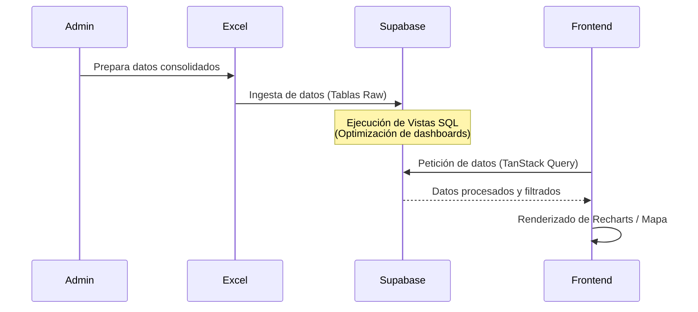

# Portal de Logros Educativos

Revolucionando la Educación con Datos:

Introducción

Los gobiernos de todo el mundo recopilan enormes volúmenes de datos, pero con frecuencia esta información permanece en bases de datos complejas o reportes estáticos. Convertir estas cifras en decisiones estratégicas es uno de los mayores desafíos de la gestión pública moderna.

En este contexto, El "Portal de Logros", es una plataforma analítica que aborda este problema de frente. Más que un simple repositorio de estadísticas, esta herramienta transforma datos complejos del panorama educativo en "conocimiento accionable". Lo logra a través de dashboards interactivos, análisis geográficos y una visión integral que conecta programas dispares.

A continuación, revelaremos cuatro de los hallazgos más sorprendentes e impactantes que ofrece esta plataforma, demostrando cómo la tecnología y una visión clara pueden redefinir el futuro de la educación de un país.


--------------------------------------------------------------------------------


Los 4 Hallazgos Clave

1. Más Allá del Diploma: Un Retrato Holístico del Ecosistema Educativo

El verdadero poder del portal no reside en contar diplomas, sino en su capacidad para mapear el ecosistema educativo de Bolivia en su totalidad. En lugar de ofrecer una visión fragmentada, presenta una imagen completa que permite entender las complejas interacciones entre sus distintas partes.

Los datos están estructurados de forma multidimensional, lo que permite un filtrado profundo y específico para encontrar respuestas a preguntas complejas. Los usuarios pueden explorar la información a través de múltiples capas de clasificación:

* Geografía: Gestión, departamento, provincia, municipio y distrito.
* Entorno: Áreas rurales o urbanas.
* Dependencia: Unidades educativas fiscales, privadas o de convenio.
* Demografía: Por sexo y subsistemas educativos (Regular o Alternativa).

Esta perspectiva holística se enriquece al consolidar información de programas clave que antes se analizaban de forma aislada. La plataforma integra los Logros de Bachillerato (DBG, BTH, IBD), los resultados de protección social como el Bono Juancito Pinto (BJP), y los datos de los Programas Nacionales de Alfabetización (PNP).

Esta visión integrada es revolucionaria. Por primera vez, un planificador podría cruzar datos del Bono Juancito Pinto (BJP) con las tasas de graduación en áreas rurales frente a urbanas para evaluar el impacto directo del programa social en el rendimiento educativo, un nivel de análisis previamente confinado a estudios académicos. Esto mueve a los responsables de políticas de la gestión de programas individuales en silos a la orquestación de un sistema educativo complejo e interconectado.

2. El Dinero Habla: Conectando Inversión con Impacto Real y Medible

Una de las capacidades más innovadoras del portal es su habilidad para trazar una línea directa entre la inversión financiera y los resultados educativos. Por primera vez, es posible no solo ver cuánto se gasta, sino también qué se está logrando con ese dinero de una manera visual y cuantificable.

El dashboard "Evolución de Impacto" es un ejemplo claro de esta funcionalidad. Mediante gráficos, compara visualmente la evolución del número de graduados de los programas de alfabetización (PNP) contra la inversión total realizada en ellos a lo largo del tiempo, permitiendo evaluar la eficiencia y el retorno social de la inversión de un solo vistazo.

La granularidad del análisis va más allá, proporcionando vistas financieras tanto a nivel micro como macro. La métrica de "Costos por Participante" permite un análisis de eficiencia operativa dentro de un programa, mientras que el dashboard de "costo promedio de graduados por departamento" facilita comparaciones estratégicas de alto nivel entre regiones. Esto ayuda a identificar mejores prácticas y a asignar fondos futuros de manera más efectiva.

Esta funcionalidad transforma el gasto público de una cifra abstracta en una herramienta de evaluación concreta. Los gestores pueden pasar de simplemente ejecutar un presupuesto a tomar decisiones informadas, transformando la supervisión financiera de un ejercicio contable reactivo en una herramienta proactiva para la asignación estratégica de recursos.

3. De Reportes Estáticos a Exploración Dinámica e Interactiva

El "Portal de Logros" rompe con el paradigma de los informes tradicionales en PDF y las hojas de cálculo estáticas. En su lugar, ofrece una experiencia de usuario completamente dinámica, convirtiendo la plataforma en un verdadero laboratorio para la exploración de datos.

Un ejemplo sobresaliente es el "Mapa Interactivo de UEs" (Unidades Educativas). Esta herramienta permite a cualquier usuario visualizar geográficamente todas las escuelas del país. Con unos pocos clics, se pueden aplicar filtros dinámicos para mostrar solo las escuelas rurales, las que ofrecen nivel secundario o las que se encuentran en un municipio específico. Al interactuar con el mapa, los tooltips revelan instantáneamente información detallada de cada sede, incluyendo los niveles que ofrece, su estado operativo y su ubicación precisa mediante coordenadas.

Este enfoque representa un cambio fundamental de mentalidad. En lugar de recibir conclusiones predefinidas en un reporte que puede quedar obsoso rápidamente, se empodera al usuario para que formule sus propias preguntas y encuentre respuestas explorando los datos directamente. Esto democratiza el acceso al conocimiento y promueve un cambio cultural de un consumo pasivo de información a una investigación activa y democrática.

4. Motor de Vanguardia: La Sorprendente Tecnología Detrás del Impacto Social

A menudo, los proyectos del sector público no se asocian con la adopción de tecnología de vanguardia. Sin embargo, el "Portal de Logros" desafía esta percepción con un stack tecnológico sorprendentemente moderno, demostrando que la innovación es clave para el impacto social.

La plataforma está construida sobre un núcleo robusto que incluye herramientas como React (v18) y TypeScript para la estructura, Tailwind CSS para el diseño, y bibliotecas especializadas como Recharts para dar vida a los datos en visualizaciones interactivas. Como backend y base de datos, se apoya en Supabase, una solución moderna y de alto rendimiento.

Elegir esta arquitectura tiene beneficios tangibles. El uso de Supabase permite implementar esquemas de seguridad avanzados como Row Level Security (RLS), garantizando que los usuarios solo accedan a la información que les corresponde. Tecnologías como React facilitan la creación de una experiencia de usuario fluida y rápida, crucial para el compromiso del usuario. Esta apuesta por la tecnología moderna no es una simple elección técnica; es una inversión en la relevancia futura de la plataforma y en su capacidad sostenida para generar impacto social.


--------------------------------------------------------------------------------


Conclusión: Una Nueva Brújula para el Futuro

El "Portal de Logros" de Bolivia es mucho más que una plataforma de visualización de datos; es una herramienta estratégica que redefine la forma en que se gestiona la educación. Al transformar cifras complejas en conocimiento claro, interactivo y accionable, proporciona una nueva brújula para guiar las políticas públicas hacia un futuro más equitativo y eficiente.

Si es posible alcanzar este nivel de claridad en un sector tan complejo como la educación, ¿qué otros desafíos nacionales podrían ser transformados al poner los datos correctos en las manos adecuadas?


# Portal de Logros 

**Portal de Datos Estadísticos de Logros Educativos de Bolivia**

El Portal de Logros es una plataforma analítica avanzada diseñada para centralizar, visualizar y analizar el panorama educativo de Bolivia durante la última década. El sistema transforma datos complejos en conocimiento accionable mediante dashboards interactivos, mapas georeferenciados y análisis de inversión-impacto.

## 📊 Alcance y Clasificación de Datos

La información está estructurada de forma multidimensional, permitiendo un filtrado profundo por:
* **Geografía**: Gestión, departamento, provincia, municipio y distrito.
* **Entorno**: Áreas rurales o urbanas.
* **Dependencia**: Fiscal, privada o de convenio.
* **Demografía**: Clasificación por sexo y subsistemas (Regular o Alternativa).

## 🛠️ Módulos Funcionales

1. El portal consolida información crítica de los siguientes programas:
**Logros de Bachillerato**:
* **DBG**: Diplomas de bachillerato emitidos gratuitamente.
* **BTH**: Seguimiento de Bachillerato Técnico Humanístico.
* **IBD**: Incentivos otorgados a Bachilleres Destacados.

2. **Protección Social**: Cobertura y beneficiarios del Bono Juancito Pinto (BJP).

3. **Programas Nacionales de Alfabetización (PNP)**:
* Resultados de Alfabetización y Post-alfabetización.
* Comunidades de Lectura.
* Análisis de **Costos por Participante** e inversión total.

4. **Censo de Unidades Educativas (UE)**:
* Estado operativo (Abierta/Cerrada).
* Oferta de niveles (Inicial, Primaria, Secundaria y combinaciones).
* Ubicación precisa mediante coordenadas de latitud y longitud.

## 🏗️ Arquitectura del Sistema
**Diagrama de Contexto**
Muestra cómo interactúa el usuario y los orígenes de datos con el ecosistema de Educa Vision AI.


**Diagrama de Componentes**
Detalle de la estructura interna basada en el stack tecnológico.


**Diagrama de Secuencia: Ingesta y Visualización**
Proceso desde la carga de datos hasta la representación gráfica.


## 📈 Visualizaciones e Interactividad
El proyecto implementa una estrategia de visualización desacoplada mediante dashboards especializados:
* **Evolución de Impacto**: Gráficos de barras y líneas que comparan la evolución de graduados vs. inversión realizada específicamente para los programas PNP.
* **Mapa Interactivo de UEs**: Visualización geográfica de todas las unidades educativas del país. Incluye filtros dinámicos y tooltips con información detallada de cada sede (niveles, estado, ubicación).
* **Miscelánea de Dashboards**:

    * Resumen anual de diplomas, títulos técnicos e incentivos (IBD).
    * Distribución de género por categorías y gestión.
    * Ranking de especialidades técnicas (BTH).
    * Costo promedio de graduados por departamento para programas de alfabetización.

## 🛠️ Stack Tecnológico

El proyecto está construido utilizando tecnologías modernas de desarrollo web:

* **Core**: [React](https://react.dev/) (v18), [TypeScript](https://www.typescriptlang.org/)
* **Build Tool**: [Vite](https://vitejs.dev/)
* **Estilizado**: [Tailwind CSS](https://tailwindcss.com/)
* **Componentes UI**: [shadcn/ui](https://ui.shadcn.com/) (basado en Radix UI)
* **Visualización de Datos**: [Recharts](https://recharts.org/)
* **Enrutamiento**: [React Router](https://reactrouter.com/)
* **Gestión de Estado y Datos**: [TanStack Query](https://tanstack.com/query/latest)
* **Gestión de Formularios**: [React Hook Form](https://react-hook-form.com/) con validación [Zod](https://zod.dev/)
* **Backend y Base de Datos**: [Supabase](https://supabase.com/)

## 🔐 Esquema de Seguridad

La seguridad del aplicativo se gestiona a través de la infraestructura de Supabase:
* **Autenticación**: Gestión de usuarios y sesiones segura mediante Supabase Auth.
* **Protección de Datos**: Uso de Row Level Security (RLS) en PostgreSQL para asegurar que los usuarios solo accedan a la información permitida.
* **Variables de Entorno**: Configuración sensible manejada a través de archivos `.env`.

## 🚀 Instrucciones de Construcción y Despliegue

### Instalación y Desarrollo Local

1.  **Clonar el repositorio**:
    ```bash
    git clone <URL_DEL_REPOSITORIO>
    ```

2.  **Instalar dependencias**:
    Navega al directorio del proyecto e instala los paquetes necesarios.
    ```bash
    cd educa-vision-ai
    npm install
    ```

3.  **Configuración de Entorno**:
    Asegúrate de tener un archivo `.env` configurado con las credenciales necesarias (ej. `VITE_SUPABASE_URL`, `VITE_SUPABASE_ANON_KEY`).

4.  **Iniciar servidor de desarrollo**:
    ```bash
    npm run dev
    ```
    La aplicación estará disponible típicamente en `http://localhost:8080` o el puerto que indique la consola.

### Construcción para Producción

Para generar una build optimizada para producción:

```bash
npm run build
```

Este comando generará los archivos estáticos en la carpeta `dist`.

### Despliegue

El proyecto es una SPA (Single Page Application) estática, por lo que puede desplegarse fácilmente en proveedores como:
* [Lovelable](https://lovable.dev/)
* [Vercel](https://vercel.com/)
* [Netlify](https://netlify.com/)

Simplemente conecta tu repositorio y configura el comando de build (`npm run build`) y el directorio de salida (`dist`).
